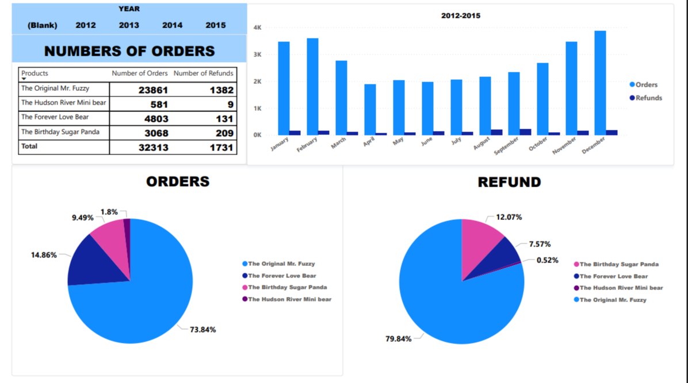

# Maven-Fuzzy-Factory-data-analysis-project
## 🏢 About the company:

Maven Fuzzy Factory is a newly launched frictional eCommerce retail startup that sells stuffed animals. The company was started on march 2012 and has been in operation for 3 years now.

## 📚 About the dataset:

This project utilizies a custom-built e-commerce database for Maven Fuzzy Factory. The data is a part of "Advanced SQL:MySQL Data Analysis & Business Intelligence". I performed Data Analysis in this data set with **POWER BI**.

## **Data Sorce** - https://www.kaggle.com/code/rubenman/maven-fuzzy-factory

## 📚 The database contains six related tables with eCommerce data about (Performed analysis on Four):

Website Activity - "Soon"

Products - Analysed

Orders - Analysed


$$
Data Model
$$

<P align="center">

</p>

<br>
<br>
<hr>

# <p align = center> Orders & Refunds Analysis Report (2012-2015) </p>

## Executive Summary

**Total Orders: 32,313 | Total Refunds: 1,731. The Original Mr. Fuzzy generated the majority of
orders and refunds. The Birthday Sugar Panda showed the highest refund concentration relative to
its sales volume**

## Key Findings

```markdown
• The Original Mr. Fuzzy: 23,861 orders, 1,382 refunds.
• The Forever Love Bear: 4,803 orders, 131 refunds.
• The Birthday Sugar Panda: 3,068 orders, 209 refunds.
• The Hudson River Mini Bear: 581 orders, 9 refunds.
• Overall refund rate: approximately 5.36%.
```

<P align="center">

</p>


## Yearly Performance

```markdown
2012: 2,586 orders, 178 refunds.
2013: 7,447 orders, 336 refunds.
2014: 16,860 orders, 985 refunds (highest sales year).
2015: 5,420 orders, 232 refunds (partial year data).
```
<P align="center">

</p>


## Business Insights

```markdown
• Product sales are highly concentrated in The Original Mr. Fuzzy.
• Refund levels increased with sales growth in 2014.
• The Birthday Sugar Panda should be reviewed for quality or customer satisfaction issues due to
  its comparatively high refund share.
• Product diversification may reduce dependence on a single product line.
```


## DASHBOARD
[📥 Download PDF](./Dashboard/Orders_Refunds_Report.pdf)

<P align="center">

</p>


<br>
<br>
<p align = center>
    <a href="" >
        
    </a>
</p>


<p align= "center">
    <a href="mailto:shubhamkeshri.433@gmail.com">
        
    </a>
    <a href="https://www.linkedin.com/in/shubhamkeshri433/">
        
    </a>
    <a href="https://github.com/Shubhamkeshri433">
        
    </a>
</p>
